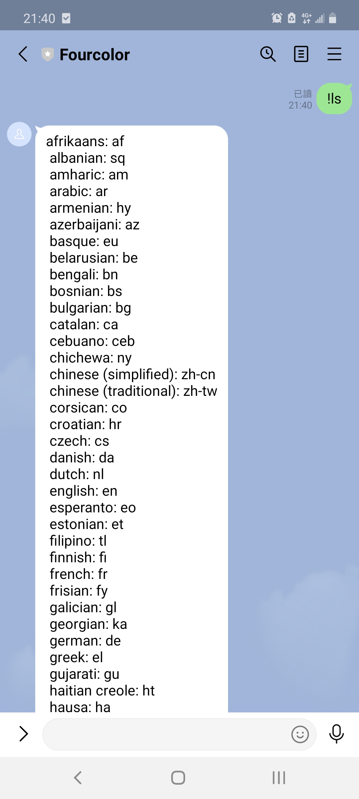
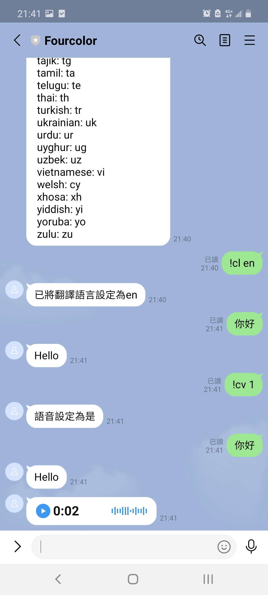
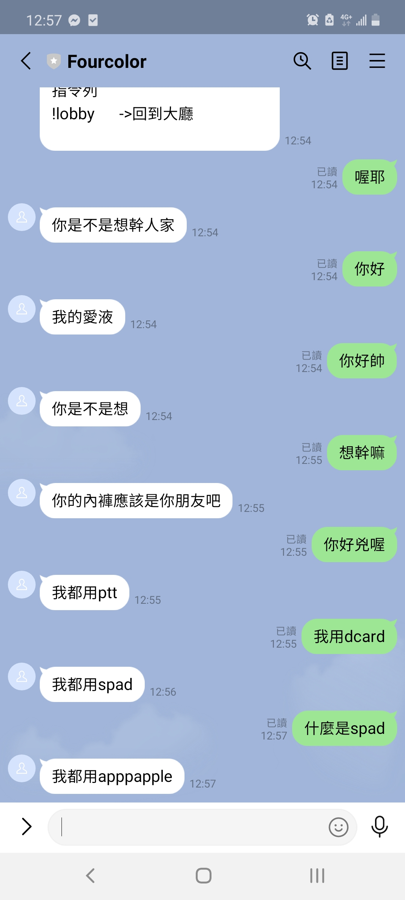
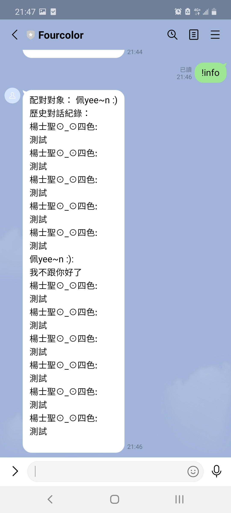
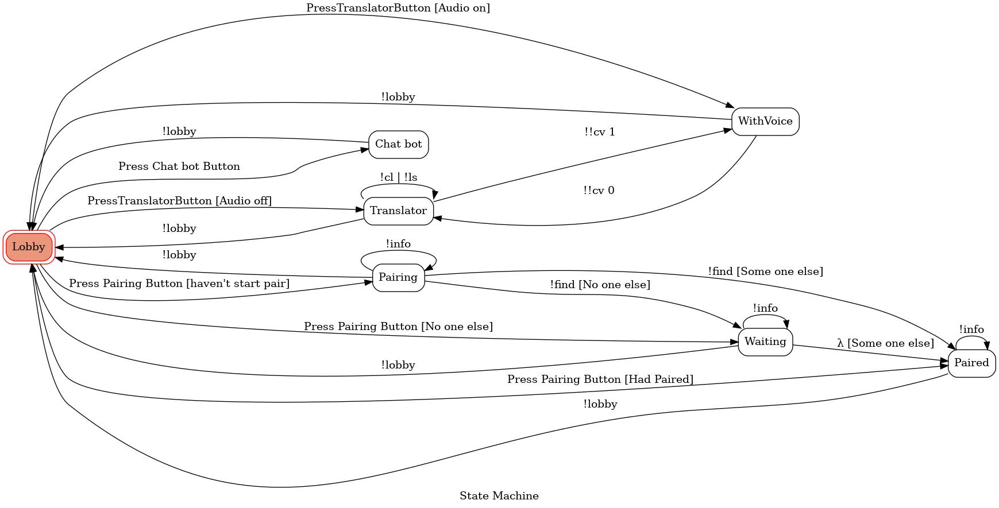

# Line bot
## Feature
* Translater
* Chat Bot
* Pair System
* Finite State Machine(FSM)
* How to deploy

 
 
### Translater
* The Translater will translate the text to the language(deflalt is Traditional Chinese) that you want, you can do some configuration by typing following command.
    * !ls -> Show the available language
    * !cl [language] -> Change the Language you want to tanslate to
    * !cv 1/0 -> Enable the audio message, it will also send audio
    * !lobby -> Go back to the lobby

 
  

 
 

### Chat Bot
* In this mode you can talk to the Chat Bot, which contributed in Transformer. And the dataset is Ptt

 
 

### Pair System
* In this mode, the Line bot will paired each other with this line bot's friend, you can do some configuration by typing following command.
    * !find -> Start to pairing(or Re-pairing)
    * !info -> Get the current partner and the history message

 

### FSM

 